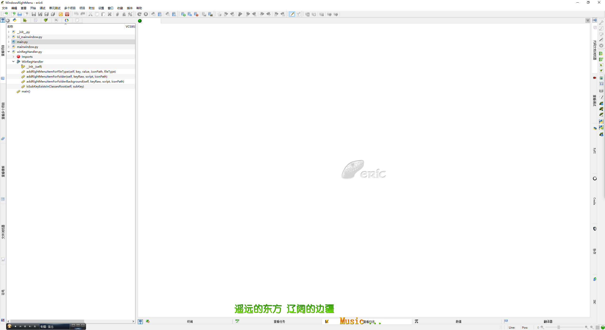
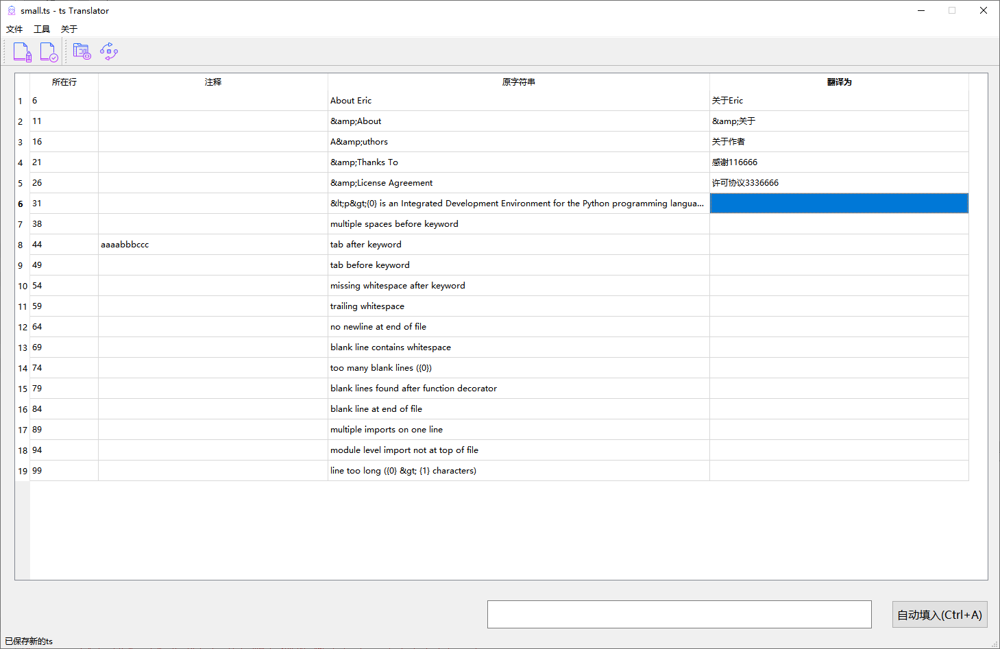

# eric-ide-zh_CN


[Eric-IDE](https://sourceforge.net/projects/eric-ide/files/eric6/stable/) 是使用 Python 基于 PyQt5 写成的免费开源的,写 GUI 程序比较好用的 IDE。

本项目维护其简体中文翻译包。


## 简体中文语言包

当前版本 V 19.05.

```bash
当前版本从 1015个资源文件中抽取了 16697 行需要翻译的字符串
目前的ts文件还有 15756 个字符串没有被翻译
已经翻译了 941 行
完成度 0.0563574294783494%。
```



## 使用

```bash
# clone 项目到本地,并进入到 qm 所在目录
git clone https://github.com/suifengtec/eric-ide-zh_CN && cd eric-ide-zh_CN/v6

# 复制 qm 文件到 eric6 的 i18n 目录
cp eric6_zh_CN.qm [这里是你的Python的安装路径]\Lib\site-packages\eric6\i18n
# 复制 qm 文件的示例
# cp eric6_zh_CN.qm D:\tools\python36\Lib\site-packages\eric6\i18n

```

## 添加进 Windows 右键菜单

请参照你的具体安装目录,修改下面的路径:

```bash

Windows Registry Editor Version 5.00
[HKEY_CLASSES_ROOT\Directory\Background\shell\eric6]
@="Open Eric6"
"Icon"="D:\\tools\\python36\\Lib\site-packages\\eric6\\pixmaps\\eric6.ico"
[HKEY_CLASSES_ROOT\Directory\Background\shell\eric6\command]
@="D:\\tools\\python36\\Scripts\\eric6.exe"


```

[该文件](addEricToRightkeyMenu.reg)已包含在这个项目中;


## ts 和 qm 是什么

都是 Qt 的国际化/本地化(i18n)文件, ts 是可编辑的文件, qm 是编译后的文件格式。

ts 采用的是类 xml 的语法的文件;
qm 是二进制的文件;

## ts=>qm

使用 lconvert:

```bash
# run the following command to find lconvert
where lconvert
# or as following on Linux:
whereis lconvert

# if found it, run
lconvert  eric6_zh_CN.ts -o eric6_zh_CN.qm

# may need to copy it to eric i18n dirctory

cp D:\tools\python36\Lib\site-packages\eric6\i18n\eric-ide-zh_CN\v6\eric6_zh_CN.qm D:\tools\python36\Lib\site-packages\eric6\i18n

```

## 统计脚本

位置

```bash

start D:\tools\python36\Lib\site-packages\eric6\i18n\eric-ide-zh_CN\v6\

```

执行

```bash

python counter eric6_zh_CN.ts
# if need to save strings to a file?
python counter eric6_zh_CN.ts true

```

## 工具

鉴于 Qt 语言大师的难用,我翻译了一百多行常用的,后续将会写一个GUI程序,以实现自动翻译,开发版本大致长这样吧:


## 备忘

Eric 装在下面的位置:

```bash
start D:\tools\python36\Lib\site-packages\eric6\i18n

```

项目 tsTranslator 的位置在：

```bash

start Y:\pyqt\tsTranslaTor

```
